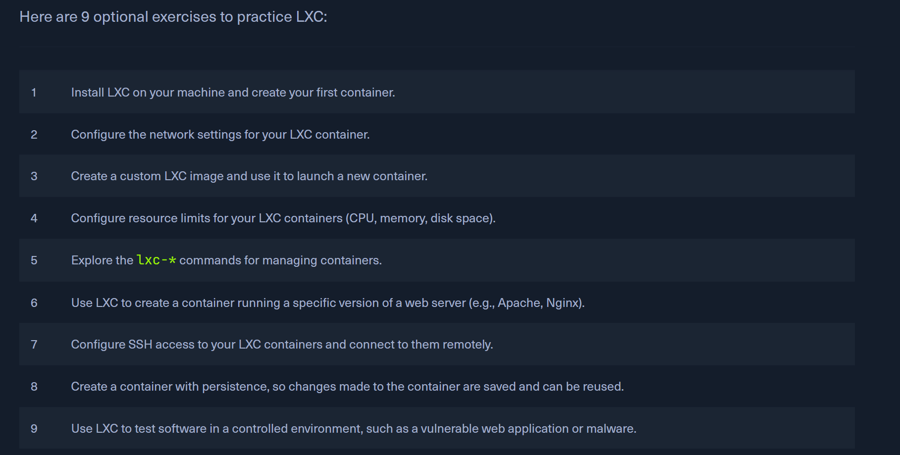

## Permision Management

- EXECUTE permissions needed to traverse a directory
- EXEC perm on dir => only allowed to traverse, not to modify or execute any files
- chmod: u-owner, g-Group, o-others, a-All users
- SUID, SGID - allows programs to be run with the right of another user. - rws 
- SUID, SGID - allways executes as the `USER WHO OWNS THE FILE` 
- Sticky bit - set on a dir, only the owner or the root user can `remove or rename` the files within the dir.  drwxrwxrw(t)
t - execute permissions set, T - no execution permission on the other users (no one can view the contents or execute the file).

## User Management
Commands : 
- sudo, su
- useradd, userdel, usermod
- addgroup, delgroup
- passwd

## Package Management
- dpkg : tool to install, build, remove and manage Debian packages(for .deb files)
- apt
- aptitude
- snap (cloud, servers, desktops, IoT)
- pip : python
- git
1. APT (Advanced Package Manager)
- Debian-based Linux
- package = ARCHIVE file with multiple ".deb" files
- dpkg is used to install programs from ".deb" files
- apt packages the .deb file AND ITS DEPENDENCIES
- the main repo from which the files are installed: /etc/apt/sources.list
- apt-cache instruction: to search through installed packages
- apt-cache search / show, apt list --installed

## Service and Process Management
- internal/user-installed services
- daemons - services running in the background without user interactions (sshd, systemd - d at the end=>daemon)

### Systemctl
- systemctl start/status/enable ssh
- enable ADDS the command (OpenSSH) to the SysV script to automatically run this service after startup
- systemctl list-units --type=service
- analyse problems with: journalctl

### Background processes
- Ctrl + Z : suspends the execution of a process
- jobs => displays the bckg proc
- bg : to put prog in bg
- add & sign to end of command to run in bg 
- fg 1 : put prog 1 in fg

### Run multiple commands
- ";" ignores previous results and errors
- "&&" stops on errors of previous commands
- '|' pipes

## Task Scheduling
- ex: automatic software updates, cleaning dbs, automating backups
- `systemd` : service for starting processes at specific times
- **STEPS**
    - `Create a timer`
        - create a directory for the timer, and a script to configure the timer.
        - script contains: "Unit","Timer","Install"
        - `sudo mkdir /etc/systemd/system/mytimer.timer.d`
        - `sudo vim /etc/systemd/system/mytimer.timer`
       
        #
            [Unit]
            Description=My Timer

            [Timer]
            OnBootSec=3min
            OnUnitActiveSec=1hour

            [Install]
            WantedBy=timers.target
        #
    - `Create a Service`
        - edit file `/etc/systemd/system/mytimer.service`
        - add path of script to run and a description
        #
            [Unit]
            Description=My Service

            [Service]
            ExecStart=/full/path/to/my/script.sh

            [Install]
            WantedBy=multi-user.target
        #
    - `Reload systemd`
        - `sudo systemctl daemon-reload`
    - `Start the Timer and Service`
        - `sudo systemctl start mytimer.service`
        - `sudo systemctl enable mytimer.service (makes it run on autostart)`

- ### Cron
    - To setup the cron daemon, we need to store the tasks in a file called `crontab` and tell the daemon when to run the tasks.
    #   
        MINUTES, HOURS, DOM, MONTH, DOW
        # System Update
        * */6 * * /path/to/update_software.sh
        # every 6th our

        # Execute scripts
        0 0 1 * * /path/to/scripts/run_scripts.sh
        #every 1st of the month at 00:00

        # Cleanup DB
        0 0 * * 0 /path/to/scripts/clean_database.sh
        #every Sunday at midnight

        # Backups
        0 0 * * 7 /path/to/scripts/backup.sh
        # every Sunday at midnight
    #

## Network Services

- `SSH` and the `OpenSSH` server; it is `encrypted`
- `NFS` (Network File System) and `NFS-UTILS` server; a kind of `FTP`;
can specify forlder, files to `share over the internet`; has encriptions, ACLs.
    - to share a file just add : `filepath hostname(rw, sync, no_root_squash)` INTO `/etc/exports`
    - to access the directory, you need to `mount the NFS share`
    - `mount ip:path_of_shared_dir path_of_local_dir`
- `Web Servers`
    -  `Apache`, `Nginx`,`Lighttpd`.
    - configurations at `/etc/apache2/apache2.conf`; specify which directories can be accessed and what actions can be performed on them.
    #
        <Directory /var/www/html>
            Options Indexes FollowSymLinks
            AllowOverride All
            Require all granted
        </directory>
    #
    - configs can also be done at the level of directories using the `.htaccess` file
    - `python3 -m http.server`
- `VPN`

## Working with Web Services
- For `Apache` we can use modules:
    - mod_ssl (encryption)
    - mod_proxy (proxy server)
    - mod_headers (manipulate HTTP headers)
    - mod_rewrite (manipulate URLs)
- `curl`: transfer files over HTTP,HTTPS, FTP, SFTP, SCP
- `wget`: download files from FTP< HTTP>

## Backup and Restore
- `Rsync` : open-source, backup files to a remote location. It only transmits the changed parts of the file, so it is good for large amounts of data.
    - `rsync -av /path/to/mydirectory user@backup_server:/path/to/backup/directory`
    - `-a` preserves the original file attributes(permissions, timestamps)
    - `-v` verbose
    - `-z` enables compression for faster transfer
    - `--backup` creates incremental backups
    - `--delete` removes files from remote host no longer present in source directory.
    - we can use the same commands, just put the remote server first and then a local path to `restore the backup`.
    - `-e ssh` : to encrypt the data transfer
    - `Auto-Synchronization` : combine cron with rsync for regular backups.
    #
        #!/bin/bash

        rsync -avz -e ssh /path/to/mydirectory user@backup_server:/path/to/backup/directory
    #
- `Duplicity`: works over Rsync, allows encription of backup copies, and storage possiblities on remote storage media (FTP/Cloud servers).
- `Deja Dup`: graphical backup tool also using Rsync.
- Ecnryption tools: `GnuPG`, `eCryptfs`, `LUKS`

## File System Management
- `Unix file system`: hierarchical structure
- **inode table** : table of info(perm,size,type,owner) associated with each file/dir

### Disks and Drives
- `fdisk, gpart, GParted` used to manage physical storage devices
- `partitioning a drive` on Linux => divide the physical storage space into separate logical sections
- `Each partition can be formated with a specific file system`
- Each partition needs to be assigned a directory = `mounting`; attaching a dir to a drive to make it accesible to the hierarchy.
- `mount` used for mounting/ listing the available mounted drives, and `/etc/fstab` used to define the default directory to mount at boot time.
- example: `sudo mount /dev/sdb1 /mnt/usb`, `sudo umount /mnt/usb`
- **!!! You cannot unmount a file system in use by other running processes !!!**
    - to check the open files on the system, use the `lsof`

### SWAP
- Swapping is when the system runs out of physical memory, so it transfer inactive pages of memory into the `swap space`, freeing up memory for the active processes.
- `mkswap` and `swapon`
- Swap space must be on `a dedicated partition/file`, and must be `ecnrypted`
- Swap space can be used for `hybernation`, when the system state stored in the swap space and computer shuts down, but doesn't power off.

## Containerization

- packaging & running apps in an `isolated environment`.
- great way to ensure apps are managed and deployed efficiently and securely.
- efficient for running multiple applications simultaneously.

**Dockers**
- **You can create a Docker image by creating a Dockerfile**
- To convert it into an image, use the `build` command
- `-t` option gives a tag to the container to identify it easily
- `A container = a running process of an image`
- `docker build -t TAGNAME /directory`
- `docker run -p hostPort:dockerPort -d TAGNAME`
- `docker ps/stop/start/restart/rm/rmi/logs`
- changes need to be save in a new Docker image!
- `Docker Compose/Kubernetes` - manage and scale containers in production environments!

        # Use the latest Ubuntu 22.04 LTS as the base image
        FROM ubuntu:22.04

        # Update the package repository and install the required packages
        RUN apt-get update && \
            apt-get install -y \
                apache2 \
                openssh-server \
                && \
            rm -rf /var/lib/apt/lists/*

        # Create a new user called "student"
        RUN useradd -m docker-user && \
            echo "docker-user:password" | chpasswd

        # Give the htb-student user full access to the Apache and SSH services
        RUN chown -R docker-user:docker-user /var/www/html && \
            chown -R docker-user:docker-user /var/run/apache2 && \
            chown -R docker-user:docker-user /var/log/apache2 && \
            chown -R docker-user:docker-user /var/lock/apache2 && \
            usermod -aG sudo docker-user && \
            echo "docker-user ALL=(ALL) NOPASSWD: ALL" >> /etc/sudoers

        # Expose the required ports
        EXPOSE 22 80

        # Start the SSH and Apache services
        CMD service ssh start && /usr/sbin/apache2ctl -D FOREGROUND
    
#
- `The /etc/sudoers file format : `
- **username  host=(runas-user) command**
- **%groupname host=(runas-user) command**
-   `ALL` as command -> any command can be run; ALL=(ALL) -> the user  is allowed to run any command as any user
- `NOPASSWD` allows users to execute commands without a passwd.
#

**Linux Containers (LXC)**
- virtualisation technology that allows `multiple ISOLATED Linux systems` to run on a `single host`
- resource isolation features: `cgroups` and `namespaces`.
- `Images are manually built!!!`, **create a root filesystem + install packages and config**
- `NOT AS EASILY PORTABLE, HARDER TO SET UP AND MANAGE, not as SECURE as Docker`
- instructions:
    - **sudo lxc-create -n linuxcontainer -t ubuntu**
    - **lxc-ls/stop/start/restart [-n \<container\>]**
    - **lxc-config -n \<container> -s storage/network/security**
    - **lxc-attach -n \<container>**
    - **lxc-attach -n \<container> -f /path_to_share**
- Use cases:
    - reproduce test systems with dependencies that are hard to replicate, or if you don't wanna mess with your system just spin up a new one with the features needed for testing.
- `Security measure`
    - **use 'cgroups' to limit the amount of CPU, memory and disk space that a container can use.**
    - **limit resources to the container** (the container shares the same kernel as the host system, so they can access all resources on host).
    - **edit changes in this file** `/usr/share/lxc/config/<container name>.conf `
    #
        lxc.cgroup.cpu.shares = 512
        lxc.cgroup.memory.limit_in_bytes = 512M
    #
    - `The share parameter`: the CPU time a container can use in relation to other containers. Default 1024 -> 512 = half of the CPU time available
    - each container has `its own` : `pid`, `networking interfaces, routing tables, firewall rules`, `root file system /mnt`(entirely different than the system's root file system).
    - namespaces provide isolation, but not total security!

## TO DO !!!
