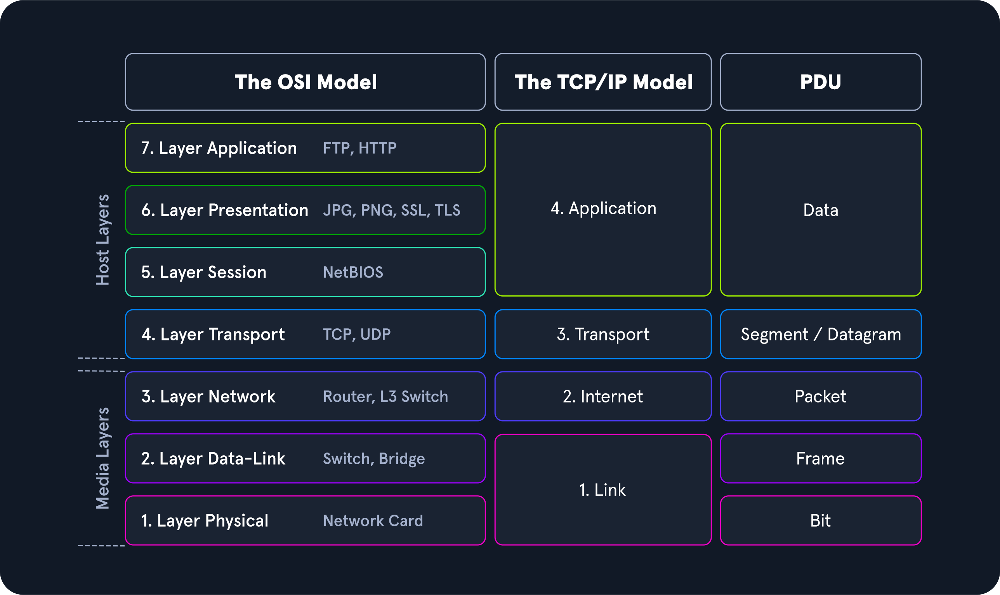

## Introduction:

    ISP - Internet Service Provider
    DNS - Domain Name Server, is where the address of the websites is paired with their IP address ( like their geographical location).

    
    WAN - Wide Area Network -- Internet
    LAN - Local Area Network -- Internal Network(Home/Office)
    WLAN - Wireless LAN - Internal Networks accessible over Wi-Fi
    VPN - Virtual Private Network -- connects multiple network sites to one LAN.

    Types of VPNs:
    - Site-To-Site, client and server are Network Devices, used to join company networks together to feel as they are in a LAN.
    - Remote access VPN 
    - SSL VPN - websites

## Network Topologies

    This refers to the typical arrangement and physical/logical connection of devices in a network.

    PHYSICAL TOPOLOGY - Transmissiom medium layout, cabling plan, position of nodes, etc.
    LOGICAL TOPOLOGY

    3 AREAS:
    - Connections: Wired and Wireless

    - Nodes - NICs(network interface controller): Router, Bridges, Swithces, Gateways, Firewalls; these are the CONNECTORS between physical and logical, receivers of electrical/optical/radio signals.

    - Classifications: topology = virtual structure of network.
    The basic types:
    -- Point-To-Point, classic 2 ends.
    -- Bus, multiple hosts connected, coaxial cable, shared medium, one can send, rest recieve
    -- Star, hosts connected to one central network component(router)
    -- Ring, physical : each host connected with 2 cables, incoming+outgouing, logical: star topology, but where the distributor simulates the ring by forwarding from one port to the other.
    ; token + claim token process, in a set direction.
    -- Mesh : Many conections, using many routers; fully meshed : all connected, partially meshed.
    -- Tree : extended star, 
    -- Hybrid
    -- Daisy Chain

## PROXIES

    Proxy = device/service that sits in the middle of a connection
          = mediator
    
    If it doesn't intercept network traffic, just passes through => GATEWAY, not a PROXY.

    Proxies operate at layer 7 of the OSI model(Application Layer)

    There are 3 main types of proxy SERVICES: 
    -- Dedicated Proxy / Forward Proxy
    -- Reverse Proxy
    -- Transparent Proxy

    1) Dedicated/Forward Proxy
    - filter outgoing requests
    - client makes request to computer that carries out then the request.
    - Explorer, Edge, Chrome all obey the "System Proxy" settings, but Firefox uses [libcurl] instead. So if the malware uses [WinSock] on any of the first browsers, it will become PROXY AWARE without additional code, which is needed information in case of a malware atack.

    ex of Forward Proxy: -- Burp Suite, forwards web requests.

    2) Reverse Proxy
    - filters ingoing requests
    - most common: listen on an address, forward it to a closed-off network.
    -- Cloudflare is a good robust network that can withstand DDOS attacks.
    -- Pentesters will configure reverse proxies on infected endpoints, that listen and send any client that connects to the port back to the attacker through the infected endpoint.
    -- useful to bypass firewalls or evade logging.
    -- even evade Intrusion Detection Systems - IDS
    - ex: ModSecurity, Web app firewall(WAF).

    3) Transparent Proxy
    - all these can be either transparent or non-transparent
    - transparent: client doesn't know about its existence.

## Networking Models

    2 models :
    - ISO/OSI model
    - TCP/IP model

    The OSI(Open Systems Interconnection) model has 7 layers:
    7) Application Layer - end user layer
    - controls input and output of data, provides the application functions.
    ----------------------------------------------------------------------
    ftp(file transfer protocol), http(hypertext transfer protocol)
    ----------------------------------------------------------------------

    6) Presentation Layer - syntax layer
    - transfer the system-dependant data into a form independent of the application.
    ----------------------------------------------------------------------
    jpg, png, ssh,ssl(secure sockets layer), tls(transport layer security - upgraded version of ssl, for encrypting data during network communications).
    ----------------------------------------------------------------------

    5) Session Layer - synchronizig and sending to port
    - controls the logical connections between 2 systems.
    ----------------------------------------------------------------------
    API's, Sockets, WinSock, NetBIOS(Network Basic Input/Output System, enables communcation between devices on the same LAN).
    ----------------------------------------------------------------------

    4) Transport Layer -end to end connections
    - can detect and avoid congestion situations.
    ----------------------------------------------------------------------
    TCP/UDP
    ----------------------------------------------------------------------

    3) Network Layer - Packets
    - connection established in circuit-switched networks 
    - data packets are forwarded through packet-switch networks.
    ----------------------------------------------------------------------
    Routers, L3 Switch(multilayer switch, both a switch and a router, 2 in 1) , IP, ICMP(error reporting protocol - Internet Control Message Protocol), IPSec(group of protocols for securing connections between devices), IGMP(Internet Group Management Protocol)
    ----------------------------------------------------------------------

    2) Data-Link Layer- Frames
    - enable reliable and error free transmission.
    - the bitsream fromm layer 1 is divided into blocks or frames.
    ----------------------------------------------------------------------
    Ethernet, PPP(computers connect through a telephone line), Switch(connects multiple clients to a network), Bridge (connects 2 networks).
    ----------------------------------------------------------------------

    1) Physical
    - transmission techniques like electrical/optical signals, or electromagnetic waves.
    ----------------------------------------------------------------------
    - Coax, Fiber, Wireless, Hubs, Repeaters
    ----------------------------------------------------------------------

    TCP/IP - general term for many network protocols.
    - provides the necesarry functions for transporting and switching data packets in a private or public network.

    OSI vs TCP/IP
    - OSI is stricter, communication gateway between network and end-users. The reference model for TCP/IP, because it is older.
    - TCP/IP allows hosts to connect to the internet!
------------------------------------------------------------------------
    
    PACKET TRANSFERS:
    - PDU( protocol data unit ) reffers to the format in which devices exchange data in different layers.
    - PDU is:
     Data : in layers 7-5.
     Segment/Datagram: in layer 4
     Packets: in layer 3
     Frames: in layer 2
     Bits: in layer 1.

    During each transmission, each layer adds a HEADER to the PDU.
    => encapsulation
    The receiver needs to unpack the data on each layer with the header information.

## TCP/IP model

    TCP/IP model is designed to work independently of the network access method, frame format and medium.
    IP ensures that the data packet reaches its destination, and TCP controls the data transfer.

    The most important tasks of TCP/IP:
    - Logical addressing(IP): many hosts in many networks, there is a need to define a logic for finding locations of hosts in networks, methods used: NETWORK CLASSES, SUBNETTING, CIDR.

    - Routing(IP): for each data packet,the next node is determined in each node, so data is routed to receiver even if its location is unknown to the server.

    - Error & Control Flow(TCP): checking if connection is still established.

    - Application Support(TCP): assign specific ports to specific applications

    - Name Resolution(DNS) - done through FQDN(Fully QUalified Domain Names).

## Network Layer

    - data is routed through the network from node to node.
    - Based on the addresses, the ROUTING and ROUTING TABLES are done.
    -- most used protocols in this layer:
    IPv4, IPv6, IPSec, ICMP, IGMP, RIP(Routing Information Protocol), OSPF(Open Shortest Path First).
    -- The sender might can't always communicate dirrectly with the receiver because it could happen that the 2 are on different networks or subnets!!! So the data is forwarded through the routers/nodes.

## IP Addresses

    Each host in the network can be identified by the Media Access Control address - MAC address.
    - MAC addr. allow data exchange within one network.
    - for connecting through different networks, you would need the IPv4 or IPv6 address, which specifies the [network] address and the [host] address.

    IPv4
    - 32 bit addr, 4 bytes.
    - the network admin assigns the network part.(IANA - Internet Assigned Numbers Authority)
    - First addr - NETWORK ADDRESS
    - Last addr - BROADCAST ADDRESS
    - DEFAULT GATEWAY - usually the first or last, but it is the IPV4 address of the router.

    CIDR - Classless Inter-Domain Routing
    CIDR suffix = the sum of all ones in the subnet mask (/24 for example).

## Subnetting

    - subnet = logical segment of a network that uses IP addresses with the same network address.
    - use of network masks
    - If the newtwork address is the same for the source and destination address, the data packet is delivered within the same subnet, else it must be routed to the other subnet via the DEFAULT GATEWAY.
    - the nr of hosts from a subnet is: 2^n - 2.
    - to identify how big the subnet will be -> 2^n, where n is the nr of 0 bits.
    
    exercises:
    1) /27 -> 3*8 + 3 -> 11100000 = 2^5 + 2^6 + 2^7 = 32 + 64 + 128 = 96 + 128 = 224
    255.255.255.224

    2) 10.200.20.0 / 27
    -> 27 = 3*8 + 3 -> 5 host bits,
    so the host bits put on 1 are 00011111 = 1+2+4+8+16 = 15+16 = 31
    => 10.200.20.31

    3) 10.200.20.0/27 - 4 subnets
    -> 27 = 3*8 + 3 , so if we need 4 subnets, we steal 2 more network bits
    /29 subnets
    255.255.255.11111000
    So then the increment will be: 2^3 = 8
    Subnets will be:
    10.200.20.0 - 10.200.20.7
    10.200.20.8 - 10.200.20.15
    10.200.20.16 - 10.200.20.31
    10.200.20.32 - 10.200.20.39

## MAC Addresses

    - 48 bit(6 bytes) Media Access Control address
    - it is the physical address for our network interfaces

    - MAC address standards:
    Ethernet, Bluetooth and WLAN.
    - MAC addr. addresses the PHYSICAL connection(network card, Bluetooth or WLAN adapter) of the host.
    ex: DE:AD:BE:EF:13:37
        DE-AD-BE-EF-13-37
        DEAD.BEEF.1337

    Each packet has a [sender address] and a [destination address].
    MAC address:
    first 3 bytes - OUI(Organization Unique Identifier) defined by the IEEE.
    last 3 bytes - (NIC)Network Interface Controller assigned by manufacturers. To ensure a unique address.

    ARP(Address Resolution Protocol) - is used to link/get the MAC address from the IP address.

    RESERVED MAC addresses:
    02:00:00:00:00:00
    06:00:00:00:00:00
    0A:00:00:00:00:00
    0E:00:00:00:00:00
    -- local range for the MAC above.

    The last bit in byte 1 identifies the MAC address as:
    Unicast - 0, to reach only one host.
    Multicast - 1

    The second last bit in byte 1 identifies wherer it is :
    Global OUI - 0
    Locally Administrated - 1

### Address Resolution Protocol

    MAC addresses can be changed/manipulated/spoofed, so they should NOT be relied upon as a sole means of security or id.
    
    Attack methods:
    - MAC SPOOFING - altering the MAC address of a device to the one of an authorized one to gain access to the network.
    - MAC FLOODING - sending too many oackets with different MAC addresses to a network switch, to reach full table capacity.
    - MAC ADDRESS FILTERING - some networks might filter certain MAC addresses.

    The Address Resolution Protocol connects layer 3(IP) to layer 2(MAC addr.), connects (IP, MAC).

    When a device on a LAN wants to communicate with another device, it sends [broadcast messages] with dest. IP and its own MAC addr.
    The the device with matching IP responds with its own MAC address => establish MAC - to - MAC connection.

    REQUEST MESSAGES IN ARP:
    - ARP REQUEST(IP addr of dest - broadcasted)
    - ARP REPLY((IP,MAC)x2 pairings for the sender and receiver).

    ATTACK METHODS:
    ARP Spoofing/Cache poisoning/poison routing - tools(Ettercap, Cain & Abel).
    The goal is to send falsified ARP messages over a LAN network, to associate our MAC address to a legitimate IP on that network, allowing us to intercept traffic.

    TO PREVENT ARP spoofing use IPSec or SSL, and implement security measures: firewalls/intrusion detection systems.

## IPv6
    - successor of IPv4
    - 128 bit long (16 bytes)
    IPv4 and IPv6 can be used simultaneously(Dual Stack)
    IPv6 doesn't need NAT.
    -- advantages:
    Larger address space, Multiple IPv6 addresses per interface, Faster routing, Mandatory IPSec.

    Types of IPv6 addr:
    1) Unicast - addresses for single interface
    2) Anycast - Addr for multiple interfaces, but only ONE of them receives the packet
    3) Multicast - Addr for multiple interfaces, but ALL receive the same packet
    4) Broadcast - DOESN'T EXIST, IT IS DONE WITH MULTICAST ADDRESSES.

    For simplicity, you can omit blocks of only 0s.
    ex: fe80:0000:0000:0000:dd80:b1a9:6687:2d3b/64
    => fe80::dd80:b1a9:6687:2d3b/64

    The IPv6 addr has 2 parts:
    --Network Prefix(network part)
    --Interface Identifier - Suffx - Host

## Networking Key Terminology

    TCP: uses a Three-Way-Handshake to establish connection.
    (SYN, SYN-ACK, ACK).

    ICMP - message types: Error messages, destination, unreachable, time exceeded.

    A crucial part of ICMP - TTL(Time-To-Live), which limits the life span of the packet in the network, to limit it from irculating indefinitely on the network in the event of routing loops.Each time packet passes router, TTL value-1. When TTL = 0 => Time Exceeded message back to sender.

    TTL may indicate:
    - nr of hops a packet has takend, aprox distance to destination
    ex: we see a ping with TTL = 122, that means we are dealing with a Windows system (TTL 128 by default) that is 6 HOPS AWAY.

    - Operating System: Windows - 128 default, (macOs, Linux) - 64, Solaris default 255.

    VoIP - Voice over IP, transmit voice calls over the internet.
    Most common VoIP ports are: TCP/5060 and TCP/5061, TCP/1720.
    SIP - session initiation protocol use these ports;
    SIP - manages VoIP activity.

    The most common SIP requests are:
    INVITE, ACK(ACCEPT), BYE, CANCEL, REGISTER(REGISTER A sip USER AGENT WITH a SIP server), OPTIONS.

    ATTACKS: - SIP allows us to enumerate existing users using the OPTIONS request => discover a SEPxxxxx.cnf, which is a config file used by CISCO CallManager.

## Wireless Networks

    - They use RADIO FREQUENCY TECHNOLOGY to transmit data between devices.
    - Each device has a WIRELESS ADAPTER, that converts data into RF signals and sends them over the air.
    - LAN uses WiFi , smaller coverage
    - WWAN uses cellular data (3G, 4G, LTE, 5G) - entire city/region
    - Communication between devices occurs over RF in the [2.4 Ghz] or [5 Ghz] bands in a WiFi network.

    When sending data over network, steps:
    1) request permission to transmit from WAP(Wireless Access Point),central device(router), which connects the wireless network to a wired network, controling access to the internet.
    2) Send data as RF signals, received by the wireless adapters of other devices on the network.
    3) Data is decoded and used.

    The strength+distance of RF signal are influenced by: transmission power, presence of obstacles, density of RF noise in environment. => To ensure reliable communication, WiFi networks use techniques such as SPREAD SPECTRUM TRANSMISSION and Error Correction.
    - SPREAD SPECTRUM TRANSMISSION:
    1) FHSS(Frequency Hoping Spread Spectrum) - which means that sender and receiver connect over a channel to exchange a seed for generating a random number, than using that random number it generates a series of hops from channel to channel such that only a fraction of the data is send through each channel. 
    => Downside: Too many BAD channels, no error checking

    2) DSSS(Direct Sequence Spread Spectrum) - the data is spread over a considerably larger bandwith than needed, where each small portion of data is associated some redundant information( ex 1 might become 00010011100). Sending it over so many frequencies, but AT THE SAME time, makes this considerably faster than FHSS, and it has error checking by comparing the redundant information patterns on the receiver's end.

# WiFi Connections

    In order to connect, you need the SSID(Service Set Identifier), password. To connect you will use the IEEE 802.11 protocol.
    When a device wants to join a WiFi network, it sends a request to the WAP to initiate the connection process(CONNECTION REQUEST FRAME).
    This contains:
    - MAC addr of the device's wireless adapter
    - SSID(network name)
    - Supported data rates
    - Supported channels 
    - Supported security protocols

    The device than uses this info to CONFIGURE the Wireless Adapter, and CONNECT to WAP, which is the gateway to the wired network.
    ** to not show the SSID, you just disable broadcast.
    ** even then, the SSID can be found in authentication packets.

    Protocols that can be used in Wireless Connections:
    IEEE 802.11, TCP/IP, DHCP, WPA2

## WEP Challenge-Response Handshake

    = process of establishing secure connection between WAP and device,where the wireless network uses the WEP security protocol.

    STEP1: Client requests access( sends association request packet ).
    STEP2: WAP responds w association response packet to client, which includes a CHALLENGE string.
    STEP3: Client CALCULATES response to the CHALLENGE string and a SHARED SECRET KEY, sends them to the WAP
    STEP4: WAP CALCULATES the expected response to the challenge with the same shared secret key, if correct, sends an AUTHENTICATION RESPONSE packet to client.

    => CRC checksum (Cyclic Redundancy Check) - error detection mechanism preventing data corruption in the WEP protocol.
    
    CRC Vulnerability!
    - we can decrypt a single packet WITHOUT knowing the ENCRIPTION KEY.
    WHY? Because CRC is calculated using the PLAINTEXT data, rater than the encrypted data.
    In WEP, the CRC value can be found in the packet header, along with the encrypted data.

## Security Features of Wifi Networks

    - Encryption(WEP, WPA,WPA2, WPA3)
    - Access Control
    - Firewall
    
### WEP vs WPA

    - WEP uses a 40bit or 104bit key to encrypt data
    - WEP is no longer compatible with newer devices/os-s and is no longer considered secure
    - WEP uses the RC4 cipher encryption algorithm, which is vulnerable. It is vulnerable, because even with 40 or 80 bits secret keys, the IV(Initialisation vector) is just 24 BITS!!!
    Which means we can bruteforce it!

    - WAP uses AES and a 128bit key
    - uses Pre-Shared Key

## Authentication Protocols

    - LEAP and PEAP , used to secure wireless conections, additional layer of security, over WPA,WEP.
    - both are base on EAP(Extensible Authentication Protocol)
    -L(layered), P(protected).

    - LEAP uses a SHARED KEY for authentication => the same key is used for BOTH ENCRYPTION AND AUTHENTICATION.
    => if key compromised, LEAP is vulnerable.

    - PEAP is more secure, uses TLS(Transport Layer Security).
    - PEAP establishes a secure connection between WAP and device using a DIGITAL CERTIFICATE, and an ENCRYPTED TUNNEL protects the authentication process.
    
## TACACS+

    - is a protocol used to authenticate and authorize users accessing network devices like routers and switches.
    - entire request packet encrypted, because it contains [user credentials], [session information].
    - encryption methods used: TLS, IPSec.

### VULNERABILITIES

    Disassociation attack
    
    - all wireless network attack
    - aims to disrupt connections between the WAP and clients.
    - sends disassociation frames to one or more clients.
    - can be done both from inside or outside the network

### PROTECTION MEASURES

    - Disabling broadcast
    This makes it harder for devices to discover and connect to the network, because it doesn't appear on the list of wifi networks available.

    - WiFi protected access(WPA)
    WPA-Personal/Enterprise, these use a CENTRALISED AUTHENTICATION SERVER(like RADIUS or TACACS+).

    - MAC filtering

    - Deploying EAP-TLS
    EAP-TLS  is a security protocl, used to AUTHENTICATE and ENCRYPT wireless communication.
    Uses a DIGITAL CERTIFICATE and a PKI(public key infrastructure).

# Virtual Private Networks

    - technology that allows a remote device to have secure and encrypted access to a private network, their resources and services.
    - when connecting to a VPN, you are ASSIGNED A LOCAL(INTERNAL) IP ADDRESS, and ther communication is done through a TUNNEL.
    - common use: Administrators use VPN's to provide secure and cost-effective REMOTE ACCESS to the internal servers.

    - commonly used ports:
    TCP/1723 - PTP Tunneling Protocol - PPTP
    UDP/500 - IKEVv1 and IKEVv2 (Internet Key Exchange)

    - VPN's can also be used for connecting multiple remote locations, such as branch offices, to make them be a part of a SINGLE PRIVATE NETWORK.

    - IKE is used to establish and MAINTAIN a secure communication between the VPN client and the VPN server.
    - VPN uses UDP 

    
    VPN components and requirements
    - VPN client - software installed on the remote device
    - VPN Server
    - Encryption
    - Authentication

    ** The VPN client and server exchange data over THE PUBLIC INTERNET securely **.

## IPSEC
    
    Internet Protocol Security

    How it works? -encrypts the data payload of each IP packet, adding an AUTHENTICATION HEADER, which is then used to verify integrity and authenticity.
    - IPsec uses 2 protocols for authentication and encryption:
    1) AH - cryptographic checksum of the data packet.(authentication and integrity of data)
    2) ESP(Encapsulationg Security Payload) - encyrption + maybe adds an authentication header, similar to AH.

    - IPsec can be used in 2 modes:
    1) Transport Mode: doesn't encrypt the IP header, used for secure end-to-end communications between two hosts.
    2) Tunnel Mode: encrypts EVERYTHING, used for createing a VPN TUNNEL between two networks.

    PPTP(Point to Point tunneling Protocol)
    - vulnerable
    -has been replaces with other VPN protocols like: L2TP/IPsec, IPsec/IKEv2 or OpenVPN.

# CISCO IOS

    They include: OSPF, BGP, VLAN Trunking Protocol(VTP), STP(Spanning tree protocol), DHCP, ACLs - Access Control Lists.

    DIFFERENT PASSWORDS:
    User, Enable Password, Secret Password, Enable Secret.

### VLAN

    = Logical grouping of network endpoints 
    = conceptually breaking down one switch into smaller mini-switches
    = is created by programming the switch(VLAN enabled switch), assigning ports to specific VLAN groups, to separate BROADCAST traffic.
    To make broadcast traffic on certain switches easier.

    VLAN is logical separation(done with just the switch, without need of routers), Subnet is physical separation.
    When computers want to communicate anything with the network, it first sends BROADCAST messages, which defines the BROADCAST DOMAIN which is equal with the LAN space.(up until the first router).
    
    popular with medium to large businesses, because it can separate broadcast domains WITHOUT moving cables, ADDING ANY ROUTER, FIREWALLS, configuring IP address.

    CISCO provies the VLAN ID's 1 - 4094

    static VLAN assignments on a switch, or dynamic with VMPS(VLAN Membership Policy Server)

    static VLANs are safer,
    dynamic VLANs can be attacked, by spoofing mac addresses, getting the membership of their VLAN, and then sniffing all network trafic sent through them.

#### Access and Trunk ports

    Any port must be either: access port(part of 1 VLAN) / trunk port(part of multiple VLAN's).
    trunk links connect trunk ports on 2 switches.

### VLAN IDENTIFICATION
    
    Standard Ethernet(802.3) frames DO NOT contain VLAN informtion.
    To identify packets, two trunkig methods are used: 
    ISL and IEEE 802.1Q

    ISL(Inter-Switch Link): deprecated.
    IEEE 802.1Q (VLAN TRUNKING):
    Ethernet frames are created that comply with the VLAN
    + add 802.1Q HEADER ->
    TPID - 2bytes (Tag protocol identifier) - 0x8100 default 
    TCI - 2bytes containing:(Tag Control Information)
        PCP - 3 bits
        DEI - 1 bit
        VID - 12 bits(VLAN IDENTIFIER)

### Assigning Network Interface Cards(NICs) a LAN in Linux

    -- first check if the kernel has the 802.1Q module loaded
    [ sudo modprobe 8021q ]

    -- check
    [ lsmod | grep 8021q ]

    -- get the physical Ethernet intergace that we will create the VLAN interface on top of: eth0 for ex.
    [ ip a ]

    -- configure the VLAN 20 for ex on top of eth0
    [ sudo vconfig add eth0 20 ]
    OR
    [ sudo ip link add link eht0 name eth0.20 type vlan id 20 ]
    
    -- check to see the new interface [ eht0.20@eth0 ]:
    [ ip a ]

    -- assign an IP address to the VLAN and then start it
    [ sudo ip addr add 192.168.1.1/24 dev eth0.20 ]
    [ sudo ip link set up eth0.20 ]

    -- check status
    [ ip a ]

## VLAN ATTACKS

    VLAN Hopping (use Yersinia)
    - enables trafic from one VLAN to be seen by another VLAN    
    - exploits the DTP(Dynamic Trunking Protocol), that automatically negotiates the formation of a trunk link between Cisco devices.
    The 802.1q protocol specifies that one VLAN on a trunk shall not be tagged(the NATIVE VLAN).
    https://redfoxsecurity.medium.com/vlan-hopping-attack-33a8b109c068
    
    -if the switch is in modes Dynamic Auto or Dynamic Desirable, it is a DTP, then the switch port is constantly waiting for a negotiation message to make itself a trunk.
    - so the attacker needs to pretend to be a switch and negotiate trunking with the switch, this is done using DTP frames.

    VLAN Double Tagging Attack(Scapy)
    - for this attack, the attacker needs to be in the NATIVE VLAN of the trunk port.
    - then he adds 2 802.1Q tags to a ethernet frame, and sends the packet to his 2nd destination like it came from the 1st destination.

    MITIGATIONS:
        - disable DTP
        - configure the NATIVE VLAN of all trunk ports to an UNUSED VLAN ID with NO HOSTS. AVOID default VLAN 1.

### Other Cisco stuff

    VXLAN - in VM's and large businesses(data centers).
    CDP - Cisco Discovery Protocol - discover and track the network topology, and helps manage and troubleshoot the network.

## Key Exchange Mecahnisms
    
    - typically the parties aggree on a SHARED SECRET KEY, transmited over insecure communication channel with encrypted communication.

    Diffie-Hellman(DH):
        + 2 parties aggree on a shared secret key without prior communication.
        +  used as the basis for TLS
        - VULNERABLE to MITM attacks.
        - large CPU power to generate secret key.
    
    RSA:
        + uses large prime numbers to generate key. p1*p2 is easy,but decomposing p into p1 and p2 is HARD.
        + used in SSL, TLS
    
    ECDH(Elliptic curve Diffie-Hellman):
        + provides FORWARD SECRECY, which ensures that past communications cannot be revealed even if the private keys are compromised.
    
    ECDSA(Elliptic Curve Digital Signature Algorithm):
        + for digital signatures.

    ----------------------------------------------------------------------------
    IKE
    - IKE uses DH + others.(VPN)
    - IKE has 2 modes: Main and Aggresive Modes.
    - Main mode: more secure, default for IKE. 3 phases.(slower performance)
    - Aggresive Mode: faster performance, 2 phases(all security parameters and keys transmitted in phase 1). (HAS NO IDENTITY PROTECTION, less protection).
    - PSK(Pre-Shared Keys) - used to authenticate the parties.
    -> good if you can securely get the PSK to both parties, additional security
    -> bad if it gets intercepted, whole IKE is ruined.

** Authentication Protocols

    PAP - password is sent in clear text over the network
    CHAP - 3 way handshake for identity checking

    PEAP - secure tunneling protocol used for wireless and wired networks. Based on EAP, uses TLS to encrypt communication.
    => BOTH LEAP AND PEAR have been replace by EAP-TLS.

** Symmetric Encryption
    - same key for encrypt and decrypt.
    - ex: AES, DES, 3DES
** ASymmetric Encryption
    - PUBLIC KEY encryption, uses both a PUBLIC key and a PRIVATE key.
    - public encrypts, private decrypts.
    - ex: RSA, PGP(Pretty Good Privacy),ECC(Elytpic curve cryptography).

    AES
    - uses 128, 192, 256 bit keys.
    - AES used in VoIP, PGP, OpenSSL, SSH, IPSec, WLAN IEEE 802.11i

    Cipher Modes
    - ECB(Electronic Code Book) - doesn't hide patterns, susceptible to attacks.
    - CBC(Cipher Block Chaining) - default mode for AES.
    - CFB(Cipher FeedBack mode)
    - OFB
    - CTR
    - GCM - in VPN's and other secure communication protocols.

