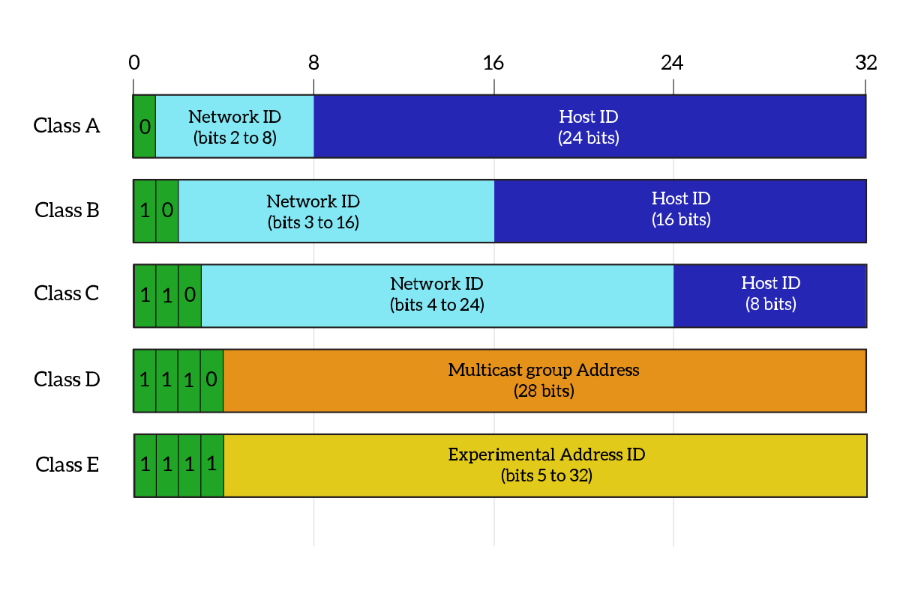

How we ran out of IP addresses
2^32 addresses

Classes:
    
    A: 1.0.0.0 - 126.255.255.255
    Signature: first bit 0
    3 bytes of host ids -- subnet mask: 255.0.0.0

    B: 128.0.0.0 - 191.255.0.0
    Signature: first bits 1|0|
    2 bytes of host ids -- subnet mask: 255.255.0.0

    C: 192.0.0.0 - 223.225.225.0
    Signature: first bits: 1|1|0
    1 byte of host ids -- subnet mask: 255.255.255.0

    D: 224.0.0.0 - 239.255.255.255
    Sigature: first bits 1|1|1|0
    Multicast group address - the rest 28 bits

    E: 240.0.0.0 - 255.255.255.255
    Signature: first bits 1|1|1|1
    Experimental address ids the rest 28 bits

    "Classfull addresses/networks"  - that obey these rules
    "Classless address" - they don't obey these rules.

    Adresses we can't touch:
    - class C, E + 127.0.0.0 with submask 255.0.0.0
    - they are loop back addresses, for these local addresses
    - so all of these 127 addresses are assigned to our local network.

The fix we had:
-- PRIVATE IP ADDRESSES + NAT

    RFC 1918
    -- private ip addresses
    -- they took some chuncks to be private!!!
    -- they are not unique

    A: 10.0.0.0 - 10.255.255.255
    subnet mask: 255.0.0.0
    
    
    B: 172.16.0.0 - 172.31.255.255
    subnet mask: 255.255.0.0

    C: 192.168.0.0 - 192.168.255.255 
    subnet mask: 255.255.255.0
    
    NAT - network address translation
    The router is doing the translation, giving a public ip address from the ISP. So every device in your LAN when going out of the network has the same public IP address given by the router.

-- we ran out of IPv4 addresses.

-- IPv6
1:1:1:1:1:1:1:1
8 bytes
phones - have IPv6 addresses.

    subnet masks: they tell us which bits are host bits(0), and which bits are network bits(1).

    when we need more networks => flip the host bits...
    ex: 
    we need 4 more => 2^2, we need to flip 2 host bits
    11111111.11111111.11111111.11000000  => 255.255.255.192
    the nr of network bits in our ip => 26 
    => network address 255.255.255.192 /26.

    The increment is the last network bit we have: ex, the last 1 digit: 64 (on position 6)

    The network is(192.168.1.0 - 192.168.1.255): 
    192.168.1.0 - 192.168.1.63
    192.168.1.64 - 192.168.1.127
    192.168.1.128 - 192.168.1.191
    192.168.1.192 - 192.168.1.255

    STEPS TO SPLIT YOUR NETWORK INTO MULTIPLE NETWORKS:
    1) Calculate how many host bits you need to hack
    2) Hack the host bits
    3) Find the increment
    4) Create the network.

    practice:
    -- split into 5
    5 is between 2^2 and 2^3 => so we need 3 bits to hack
    11111111.11111111.11111111.11100000  => 255.255.255.224
    the nr of network bits in our ip => 27
    => network address 255.255.255.224 /27.

    The increment is 32.(2^5)

    The network is:
    192.168.1.0 - 192.168.1.31
    192.168.1.32 - 192.168.1.63
    192.168.1.64 - 192.168.1.95
    192.168.1.96 - 192.168.1.127
    192.168.1.128 - 192.168.1.160

--------------------------------------------------------------

    practice-last-video
    40 hosts per coffee shop.

    10.1.1.0 /24 

    for 40 hosts we need: 2^6 > 40 ; 6 bits
    To flip hosts: we need to SAVE bits from right to left.
    11111111.11111111.11111111.11[000000]    
    
    The increment is 2^6 = 64.

    10.1.1.0 - 10.1.1.63 -- subnet masks: 255.255.255.192 /26.
    10.1.1.64 - 10.1.1.127
    10.1.1.128 - 10.1.1.191
    10.1.1.192 - 10.1.1.255

--------------------------------------------------------------

    Given the IP address, the subnet mask and the default gateway, find out what is: 
    ex: 172.17.16.255 - subnet mask: 255.255.240.0

    THE NETWORK ADDRESS:?
    THE BROADCAST ADDRESS:?
    THE NETWORK RANGE:?

    The subnet mask in binary:
    11111111.11111111.11110000.00000000 /20
    The increment is 2^4 = 16.

    172.17.0.0 - 172.17.15.255
    172.17.16.0 - 172.16.31.255
    ...

    So our IP is in the second network.
    The BROADCASTIN NETWORK IS THE LAST IP ADDRESS IN THAT NETWORK:
    -- in our case(slot 2) it is 172.16.31.255
    so the IP address is valid

    So Bernard is on a completely different network.
    48.25.24.71 /21
    11111111.11111111.11111000.00000000 /21
    Increment is 2^3 = 8
    => ranges:
    48.25.0.0 - 48.25.8.255
    48.25.8.0 - 
    48.25.16.0 - 48.25.23.255
    48.25.24.0 - 48.25.31.255  -> here* 

    So the broadcast address is: 48.25.31.255

--------------------------------------------------------------

    Hackwell Industries:
    172.21.42.0 /24

    guest - 10
    robots - 57
    serves - 26
    workers - 117

    Use VLSM - variable length subnet masks

    take largest first:
    117 - 2^7 > 117, so we need to SAVE 7 bits
    11111111.11111111.11111111.10000000 /25
    255.255.255.128 subnet mask
    
    Increment is 128, 2^7
    172.21.42.0 /25 - 172.21.42.127

    Take the robots then:
    57 - 2^6, we need to save 6 bits
    increment is 64
    11111111.11111111.11111111.11000000 /26
    172.21.42.128 - 172.21.42.191 /26

    Take the servers then:
    26 - 2^5, we save 5 bits
    increment is 32
    11111111.11111111.11111111.11100000 /27
    172.21.42.192 - 172.21.42.223 /27

    Take the guests then:
    10 - 2^4, we need to save 4 bits
    increment is 16
    11111111.11111111.11111111.11110000 /28
    172.21.42.224 - 172.21.42.239 /28

    TO DO THIS, GO FROM BIG TO SMALL

** TRY OUT BOZON(EVEN SOME CCNA STUFF), ITPROTV

    

    
